# Guía de despliegue local
## Requisitos de software y hardware
Para la puesta en marcha y ejecución del entorno de desarrollo y despliegue local utilizando tecnologías de contenedores y virtualización, se requiere lo siguiente:
* Sistema Operativo: Windows 10/11 con soporte para características de virtualización habilitadas.
* Subsistema de Windows para Linux (WSL 2): Entorno Linux integrado para la ejecución de herramientas de desarrollo.
* Contenedores: Docker Desktop instalado con el backend de WSL 2 activado.
* Control de Versiones: Git configurado dentro del entorno de WSL (Ubuntu).
## Instalación de dependencias y configuración del entorno
### Instalación WSL
#### a. Abrir la terminal de comandos:
Presiona las teclas Windows + X en tu teclado y selecciona PowerShell o Terminal (también puedes buscar "PowerShell" en el menú de inicio de Windows).
#### b. Verificar e iniciar el subsistema:
Ejecuta el siguiente comando para ver las distribuciones de WSL instaladas y su estado:
```bash
wsl -l -v
```
(Nota: Si es la primera vez que configuras WSL o te pide instalar un entorno, presiona cualquier tecla o sigue las instrucciones en pantalla para completar la descarga e instalación del sistema Linux).
#### c. Actualizar el subsistema:
Ejecuta el siguiente comando para asegurarte de que tienes la versión más reciente del núcleo de WSL:
``` bash
wsl --update
```
#### d. Instalar o configurar el entorno:
A continuación, ejecuta el comando de instalación para completar la configuración de la distribución de Linux:
``` bash
wsl --install
```
#### e. Validar la lista de distribuciones disponibles en línea:
Ejecuta el siguiente comando para ver las distribuciones de Linux disponibles oficialmente para instalar en WSL:
``` bash
wsl --list --online
```
#### f. Instalar la distribución deseada:
Ejecuta el comando de instalación especificando el nombre de la distribución que elegiste (en este caso Ubuntu):
``` bash
wsl --install -d Ubuntu
```
#### g. Iniciar Ubuntu:
Una vez finalizada la instalación, puedes abrir y acceder a tu entorno de Ubuntu de cualquiera de las siguientes maneras:
##### Opción 1 (Desde el Menú de Inicio):
Presiona la tecla Windows, escribe Ubuntu en el buscador y haz clic en la aplicación para abrir la terminal de Linux.
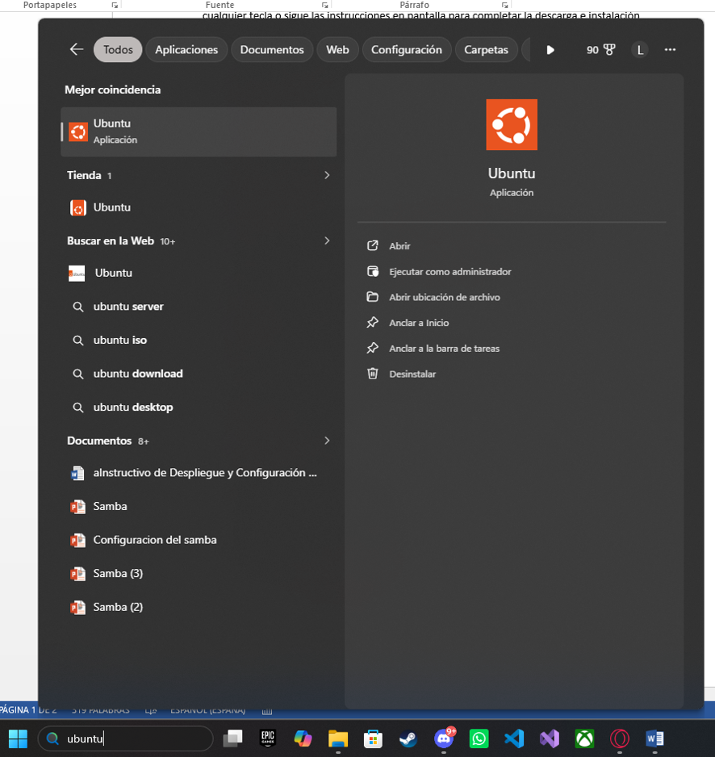
##### Opción 2 (Desde PowerShell o Terminal):
Abre PowerShell y ejecuta el siguiente comando para iniciar sesión directamente en tu distribución:
``` bash
wsl -d Ubuntu
```
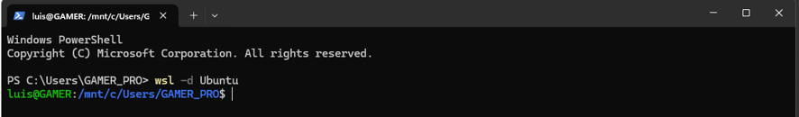
### Instalación de Git
Abre tu terminal de Ubuntu (siguiendo los pasos anteriores).
Actualiza la lista de paquetes del sistema ejecutando:
``` bash
sudo apt update
```
Instala Git ejecutando el siguiente comando:
``` bash
sudo apt install git –y
```
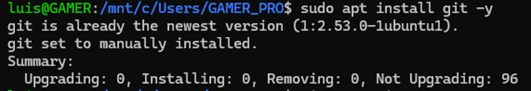
Verifica que se haya instalado correctamente comprobando su versión:
``` bash
git –versión
```
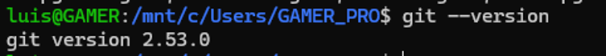
## Instalación de docker
Ingresa al sitio web oficial de la documentación de Docker para Windows en el siguiente enlace:
https://docs.docker.com/desktop/setup/install/windows-install/
Descarga e instala Docker Desktop siguiendo los pasos que indica el asistente en pantalla.
### Configuración de la integración con WSL en Docker Desktop:
* Abre Docker Desktop en tu computadora.
* Dirígete a la sección de configuración haciendo clic en el icono de engranaje (Settings).
* Navega a la ruta: Resources -> WSL Integration.
* Busca tu distribución de Ubuntu en la lista y actívala (habilítala) para permitir que Docker funcione directamente dentro de tu entorno de Linux.
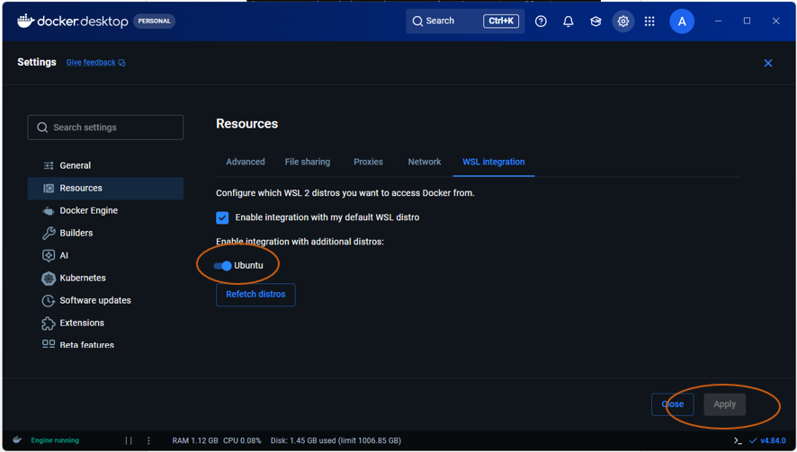
### Validar Docker desde Ubuntu:
Abre tu terminal de Ubuntu.
Ejecuta el siguiente comando para verificar que Docker se reconozca correctamente en el entorno de Linux y comprobar su versión docker -v.
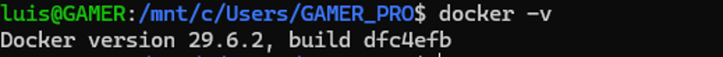
Realiza una prueba ejecutando el contenedor de comprobación oficial:
docker run hello-world
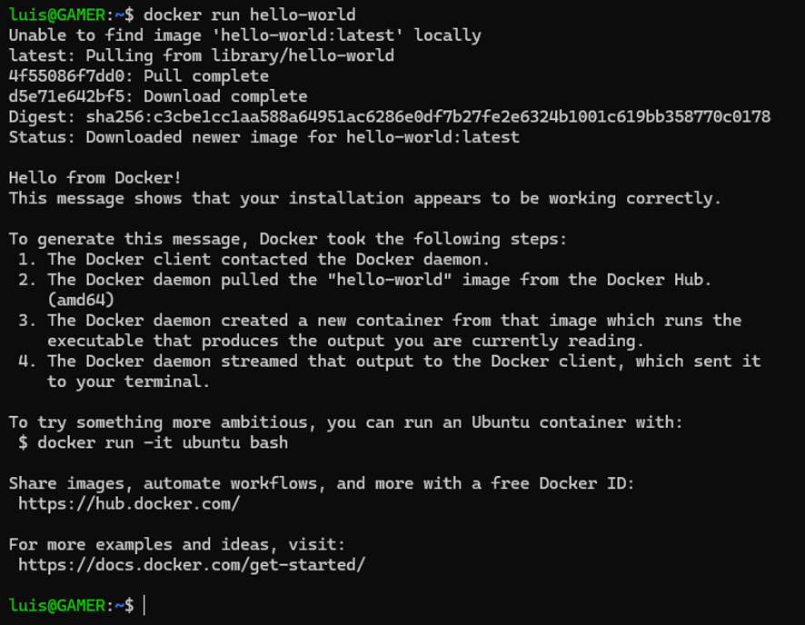
Por último, abre la interfaz gráfica de Docker Desktop en Windows y valida que el contenedor de prueba se haya ejecutado y configurado correctamente.
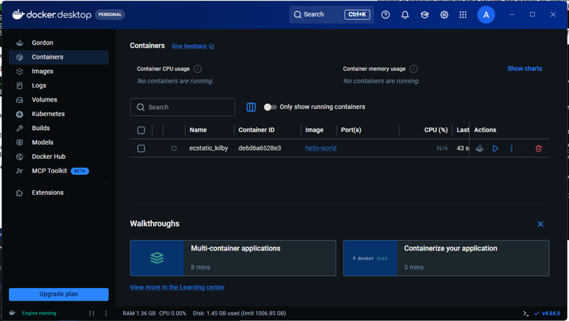
## Clonación del Repositorio del Proyecto
Abrir la terminal de Ubuntu:
Abre tu terminal de Ubuntu (en WSL) donde tienes configurado Git.
Navegar al directorio de trabajo:
Ubícate en la carpeta donde deseas descargar el proyecto (por ejemplo, en tu directorio personal o una carpeta de proyectos):

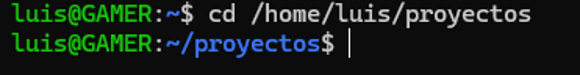

Clonar el repositorio:
Ejecuta el comando git clone seguido de la URL del repositorio remoto de tu proyecto:
``` bash
git clone https://github.com/ArmandoCasas14/Proyecto-Inventario.git
```
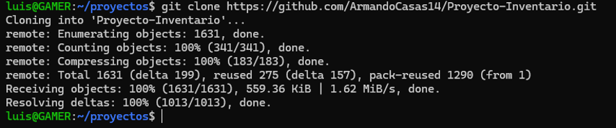
Una vez finalizada la descarga, entra a la carpeta del proyecto con:
```bash
cd Proyecto-Inventario
```
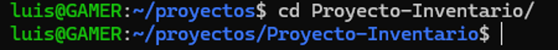
## Instalacion php
Ya que esta el proyecto en local es necesario descargar php para el uso de composer, el cual será necesario para gestionar las dependencias necesarias y así poder levantar el aplicativo en Docker
Se recomienda actualizar la lista de paquetes de Ubuntu para evitar problemas de versiones o falta de librerías. Para ello se puede usar los siguientes comandos:
``` bash
sudo apt upgrade 
sudo apt update
```
Ya que se ejecutan los anteriores comandos se puede usar el siguiente para descargar php:
``` bash
sudo apt install php-cli php-mbstring php-xml php-zip php-curl
```
Después de ejecutar se puede verificar la instalación con php -v para esta aplicación en específico se requiere de php 8.5 o superior
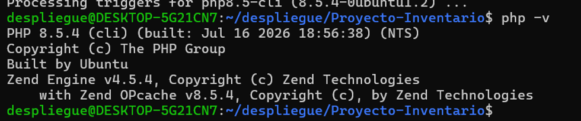
Ya que se tiene php se prosigue con el gestor de dependencias composer:
``` bash
sudo apt install composer
```
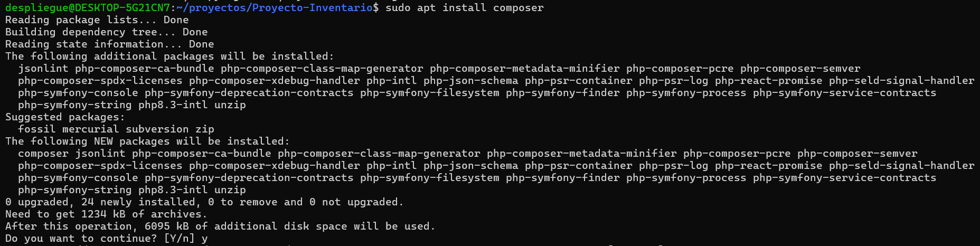
Durante la instalación va a preguntar si se desea continuar, solo se presión (y) y se continua. Con eso ya se tiene php y su gestor de dependencias, para continuar se debe configurar el archivo .env, el cual ayudara a desplegar sail para levantar los contenedores con docker
## Configuración del Archivo .env
Se clona el archivo .env.example el cual va a servir como base para el .env este contiene todo lo básico necesario para el despliegue inicial con sail. Para ello se puede usar el siguiente comando:
``` bash
cp .env.example .env
```
Después de ejecutar nos dejaría un nuevo archivo .env el cual podemos ver haciendo uso de visual studio con el comando code .
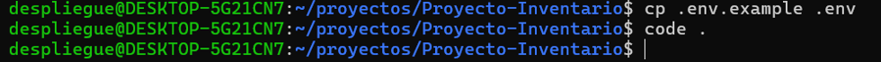
Se nos abriría una ventana así:
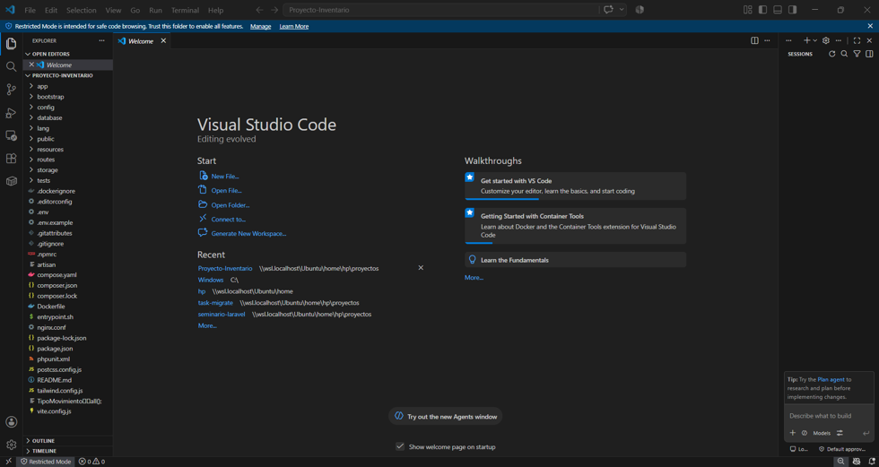
En el panel izquierdo se pueden observar todos los archivos del proyecto, entre ellos el .env 
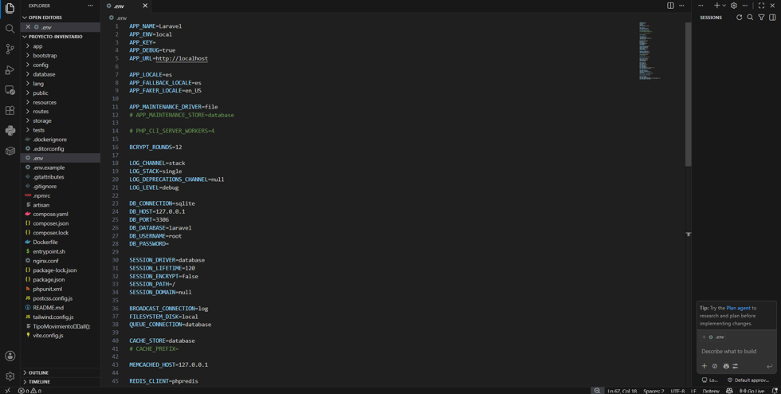
Como se observa en la anterior imagen así debería de verse el .env por ahora.
Para la base de datos de la aplicación se hace uso de mysql, entonces previo a realizar el despliegue se debe configurar las credenciales que va a usar dicha base de datos. Para el despliegue en entorno de desarrollo se puede hacer uso de las siguientes
DB_CONNECTION=mysql 
DB_HOST=mysql 
DB_PORT=3306 
DB_DATABASE=laravel
DB_USERNAME=sail DB_PASSWORD=password 
Se pueden reemplazar en el archivo .env por las que ya estan configuradas de ejemplo o se pueden comentar las del ejemplo y abajo añadir las nuevas. 
En el archivo .env se pueden añadir configuraciones extras según la necesidad. Como añadir un puerto con APP_PORT=8080 para que el aplicativo se despliegue en ese puerto y no en el 80 por defecto
## Configuración dependencias para el despliegue local
El siguiente paso es ejecutar el comando que va a descargar las dependencias como sail, laravel, laravel/brezee que están guardadas en los archivos composer.json y composer.lock
Así se crea el directorio vendor y podemos pasar al despliegue con docker, para ello se debe ejecuta el siguiente comando:
``` bash
composer install
```
Debería mostarse algo como esto:
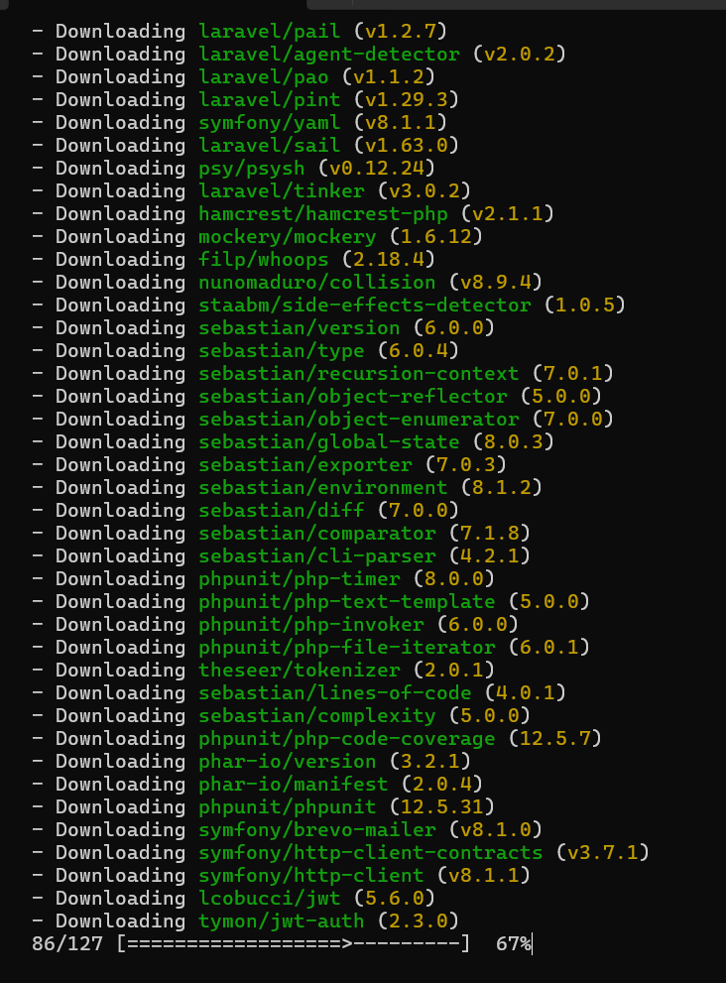
Al finalizar la descarga ya se podría iniciar los contenedores en docker con el siguiente comando:
``` bash
./vendor/bin/sail up -d
```
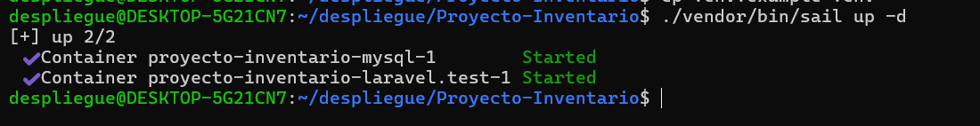
Después de encender las maquinas con dicho comando, la aplicación se mostraria con el siguiente error:
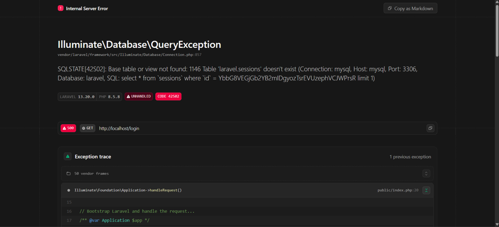
Esto a falta de ejecutar migraciones, al desplegarse apenas por primera vez la base de datos esta completamente vacía, para cargar las tablas necesarias se debe ejecutar el siguiente comando:
``` bash
./vendor/bin/sail artisan migrate
```
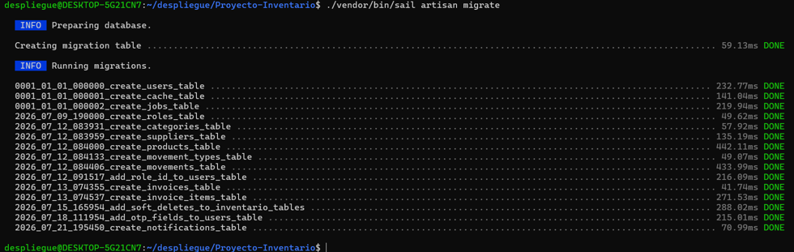
Con ello se crean todas las tablas necesarias para el funcionamiento del aplicativo. Para hacer uso de datos de ejemplo en las tablas se pueden ejecutar los sedeers previamente configurados, para ello se puede usar el siguiente comando:
``` bash
./vendor/bin/sail php artisan db:seed
```
Con esto se cargan todos los datos configurados en los sedeers. Después de esto el error de la base de datos se quita y pasamos al siguiente:
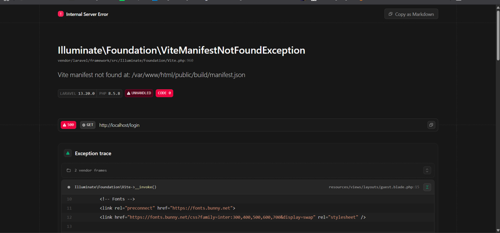
Este error se da por la falta de una dependencia que usa laravel para cargar la lógica del frontend como css y javascript
Para instalarla se puede hacer uso del siguiente comando:
``` bash
./vendor/bin/sail npm install
```
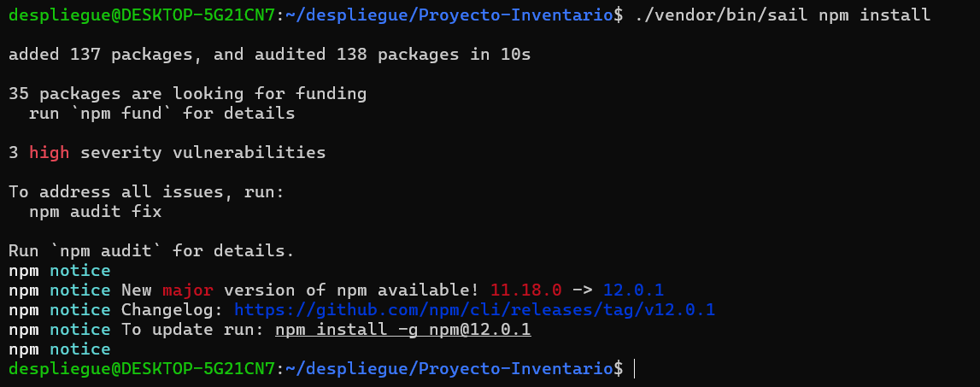
Y para compilar los archivo de dicha dependencia:
``` bash
./vendor/bin/sail npm run build
```
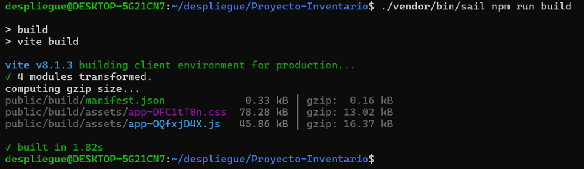
Con esto instalado la aplicación se puede acceder por internet haciendo uso de localhost o localhost: + el puerto configurado en el .env, y se nos mostraría lo siguiente
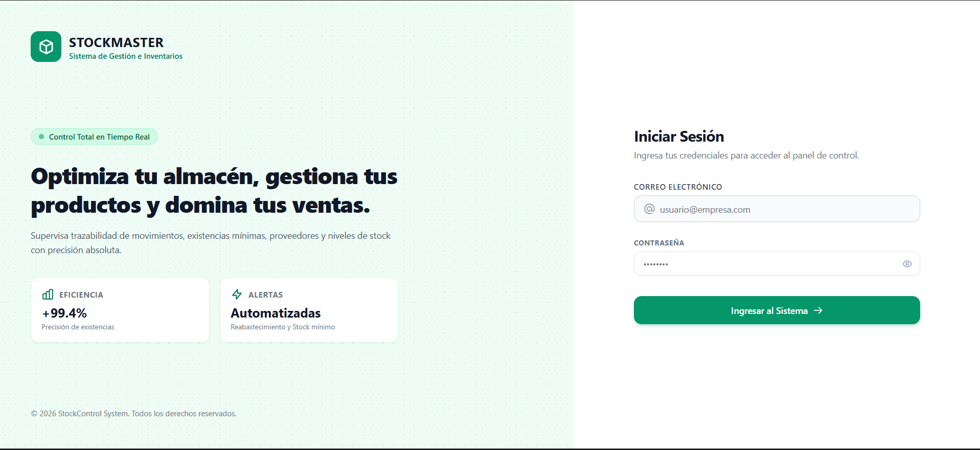
Esta es ya la aplicación desplegada con docker y abierta en la web. Con los datos preconfigurados.
# Despliegue en Render
El despliegue de la aplicación en Render se realiza mediante tres archivos principales: Dockerfile, nginx y entrypoint. Su función es facilitar el proceso, ya que entre los tres se encargan de construir el entorno, configurar el servidor web y ejecutar los comandos necesarios para que la aplicación arranque correctamente cada vez que se inicia.
Estos archivos ya están creados en el repositorio del proyecto, facilitando parte del proceso de despliegue. Teniendo ya estos archivos lo que haría falta es configurar una base de datos y las variables de entorno en render para así poder desplegarlo sin problema. 
## Base de Datos en Render
Se debe ingresar a la página de render para ello se puede usar el siguiente link:
* render.com

Se debe seguir el proceso normal de logueo registrándose o iniciando sesión con una cuenta ya creada, debería de mostrar el siguiente dashboard:

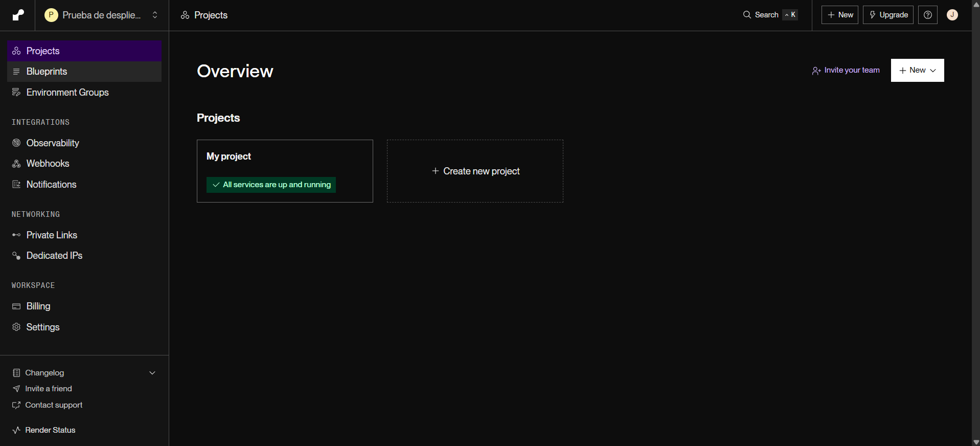
Ya dentro del dashboard de render se puede crear el servicio para la base de datos, para ello se selecciona en la opción de new que se observa en la imagen, se despliega el siguiente menú:
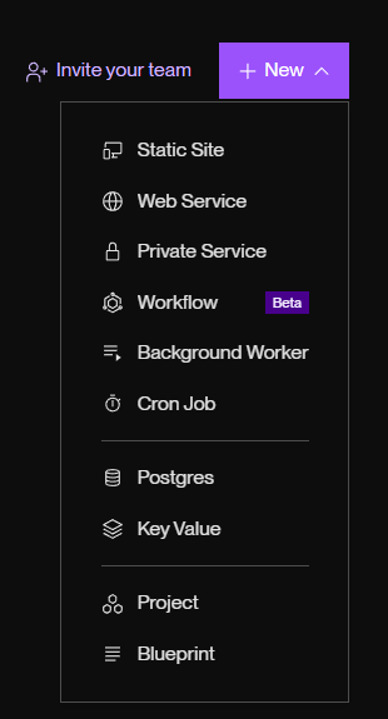

Se debe seleccionar la opción que dice Postgres.
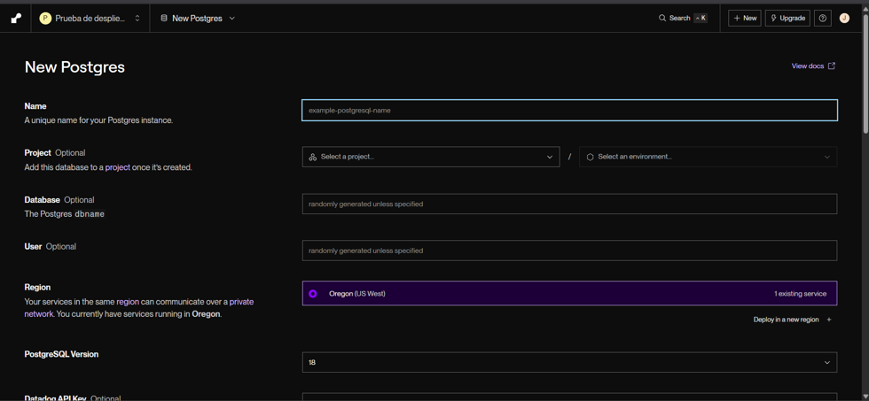
Se puede poner un nombre cualquiera, como “Base de datos para despliegue” en project, se puede dejar vacío en Database le ponemos el nombre de la base de datos en este caso le podemos poner la que configuramos en el .env, en usuario se debe poner el nombre del usuario administrador, en la región se puede poner la más cercana a la ubicación, y asegurarse de recordar dicha ubicación porque se debe usar luego para el servicio del aplicativo.
El resto de opciones se pueden dejar vacías o por defecto. Luego se selecciona el plan gratuito 
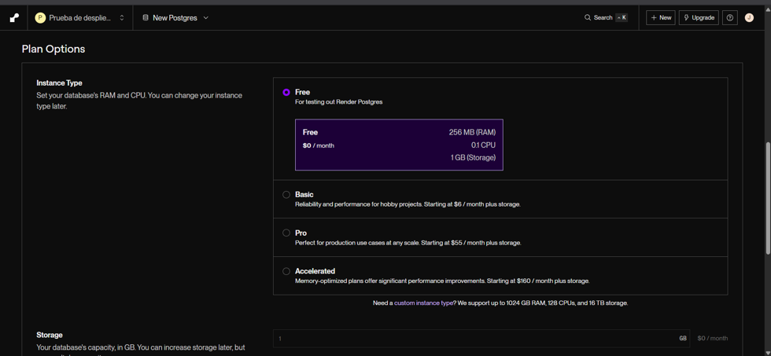
Y se puede bajar del todo para seleccionar create database, esto despliega la base de datos de postgres con los datos que le dimos, esperamos a que aparezca activa y con eso ya la tendríamos.
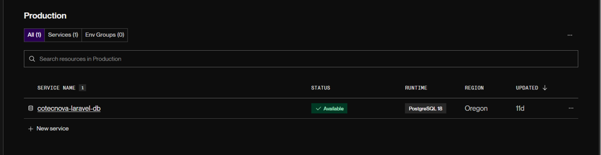
Ya que la base de datos se vea con la verificación de available se puede seguir con el despliegue del aplicativo, para ello se debe subir el repositorio local del proyecto a github, ya que render usara github para leer los archivos y desplegar la aplicación.
## Crear Repositorio en Github
Para subir el proyecto hay que crear el repositorio al que se va a subir todo en github
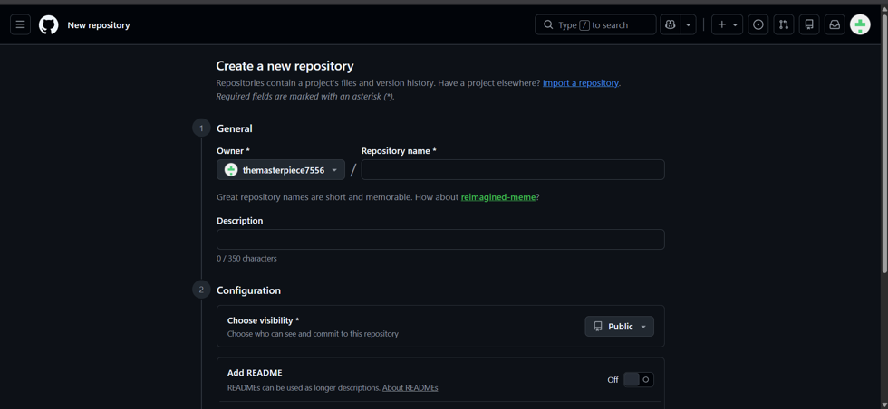
Se entra a github se selecciona la opción de un nuevo repositorio, se puede poner el nombre que se desee y se deja sin marcar las opciones que aparecen en configuration ya que el repositorio ya tiene esos archivos en local, se le da en crear y con eso se tendría para subir.
En la consola de la maquina Ubuntu local se entra a la raíz del proyecto
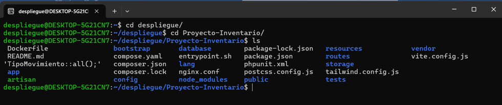
Se ejecuta el siguiente comando, para quitar el enlace que tiene el repositorio local con el repositorio de github con el que se descargó.
``` bash
git remote remove origin
```
Y luego ya se puede poner el nuevo link para enlazarlo con el repositorio al que se quiere subir:
``` bash
git remote add origin https://github.com/tu-usuario/tu-nuevo-repo.git
```
El link que se debe poner después del add origin es el que se encuentra en la raíz del repositorio en github que se creó previamente.
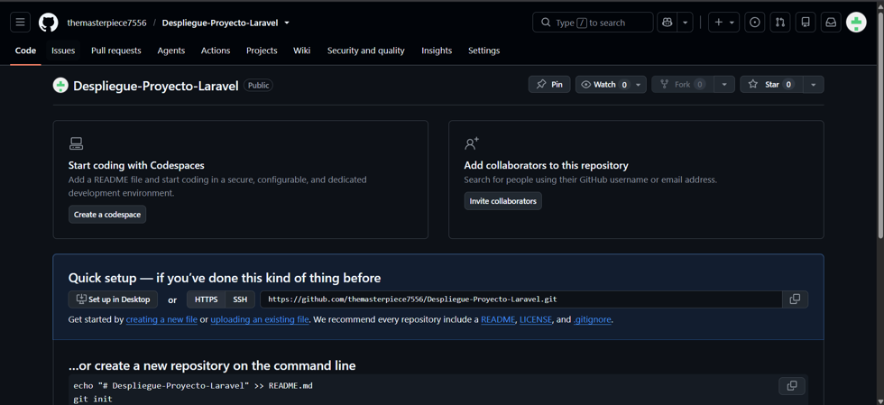
Se selecciona la opción de copiar el link que sale en el quick setup y se pega en el comando anterior, se ejecuta y ya con esto el repositorio local estaría conectado con el nuevo repositorio en GitHub.
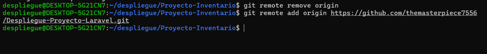
Para subir el repositorio se manda el siguiente comando:
``` bash
git push origin master
```
Y se deberia de mostrar el siguiente flujo
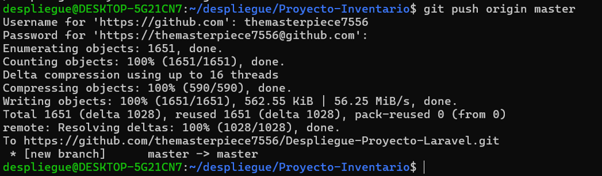
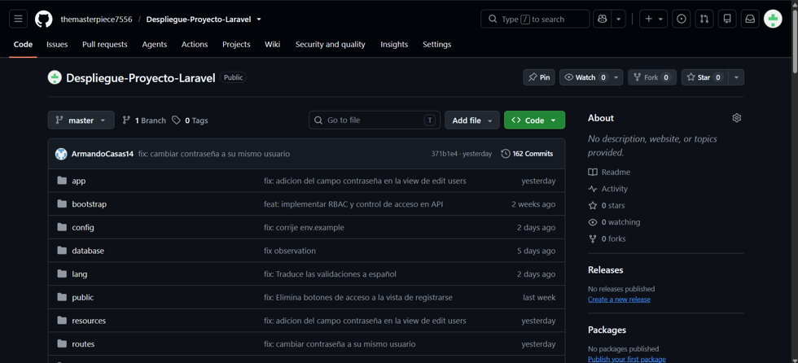
Como se puede observar ya se tienen todos los archivos del repositorio local en el github excluyendo los archivos puestos en el gitignore.
En caso de que no se tengan las credenciales del usuario de github configuradas en la el git local, dará un error al ejecutar el comando para subir el proyecto, esto se puede corregir usando los siguientes comandos para registrarse:
``` bash
git config --global user.name "Tu Nombre o Usuario de GitHub"
git config --global user.email "tu_correo@ejemplo.com"
```
Con esto ya debería de permitir subir todo sin problema.
## Configuración del Aplicativo en Render
Se debe dirigir nuevamente al dashboard, se da en el botón new para añadir un nuevo servicio, y se selecciona el servicio web Service 
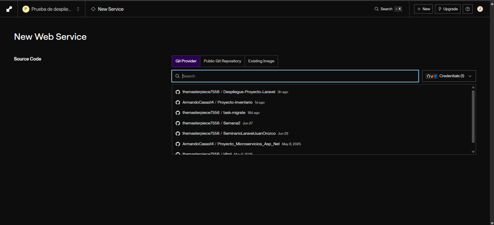
Se despliega algo como lo anterior si se esta logueado con github se muestran los proyectos de los cuales se puede crear el servicio web, sino se puede seleccionar la opción de conectar render con GitHub para así conectar el repositorio.
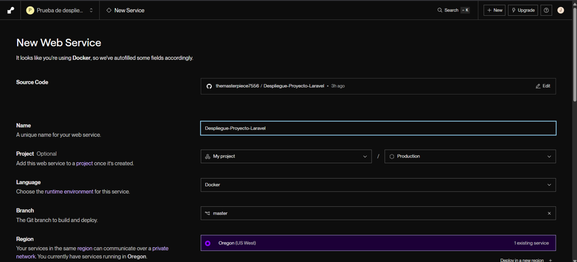
Al seleccionar el repositorio se debe mostrar la información con la que se va a configurar el servicio web, como nombre se debe poner el nombre que queramos que se muestre en la página, en project se puede dejar vacío como se hizo en la base de datos, en language se debe poner estrictamente docker ya que nuestro aplicativo esta configurado para desplegarse con docker, en región se selecciona la misma que se uso para la base de datos, se deja el plan en free y luego se pasa a la configuración de las variables de entorno
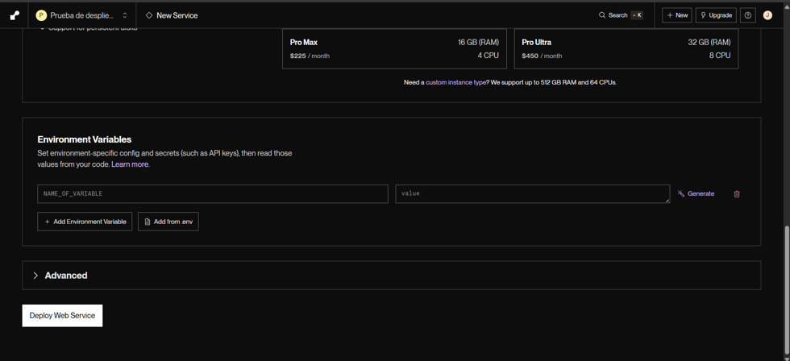
Aquí se deben añadir las siguientes variables:
| Variable | Valor / Descripción |
| :--- | :--- |
| `APP_ENV` | `production` |
| `APP_DEBUG` | `false` |
| `LOG_CHANNEL` | `stderr` |
| `APP_KEY` | Ejecutar `php artisan key:generate --show` |
| `DB_CONNECTION` | `pgsql` |
| `DATABASE_URL` | Copiar y pegar la *public database url* |
| `DB_URL` | Copiar y pegar la *internal database url` |
| `JWT_SECRET` | Ejecutar `php artisan jwt:secret --show` |

La internal url y external url se consiguen en el servicio de postgres, dirigiéndose al dashboard
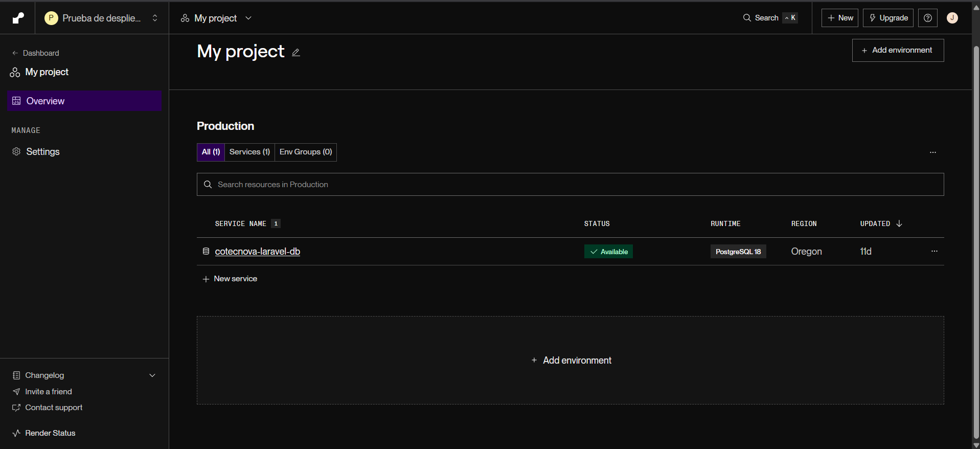
Se selecciona el servicio de postgres
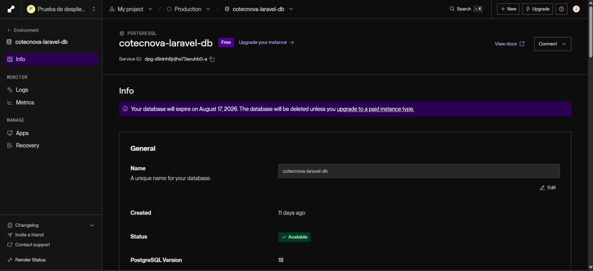
Y se busca el apartado de connections
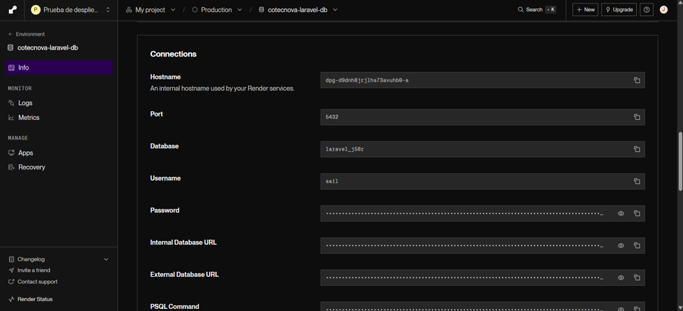
Aquí se pueden seleccionar y copiar las variables de internal database url y external databse url. 
La configuración de variables de entorno debería quedar viéndose así:
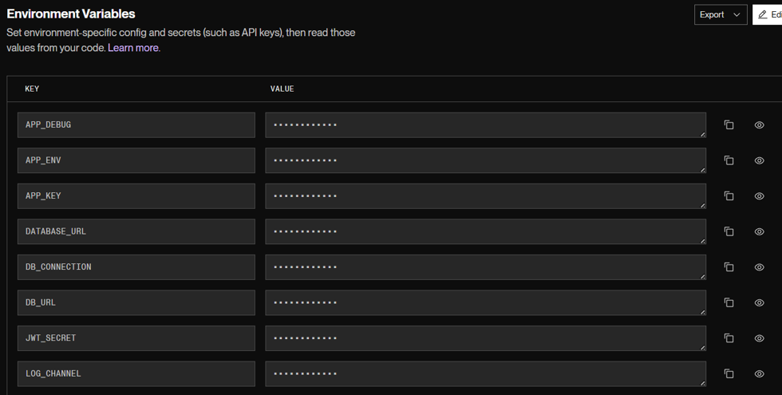
Con esto configurado ya se podría pasar al final de la pagina y darle al botón de deploy web Service.
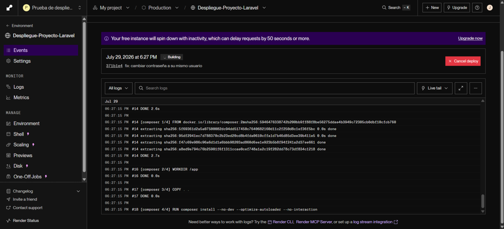
Se pasa a cargar el aplicativo como se puede observar en la imagen 
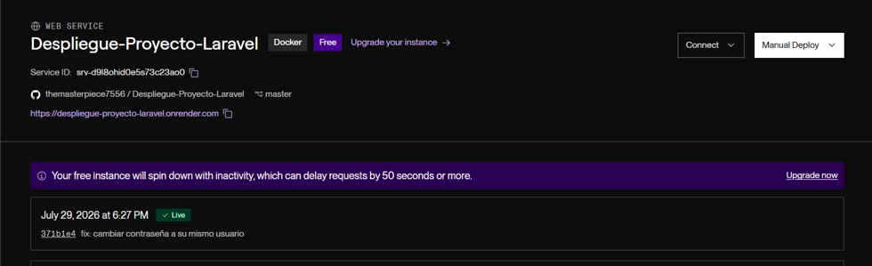
Ya que la aplicación carga se puede acceder a ella desde el link generado por render en este caso es https://despliegue-proyecto-laravel.onrender.com
Al entrar ya se podría ver la aplicación desplegada y accesible desde cualquier lugar con el link dado por render
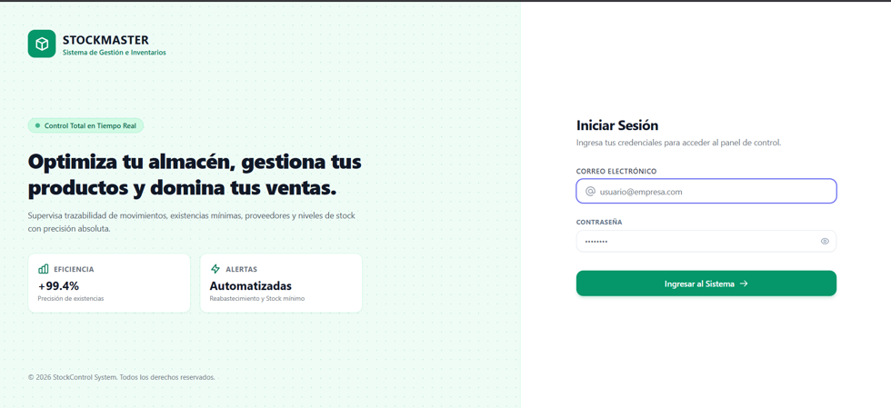